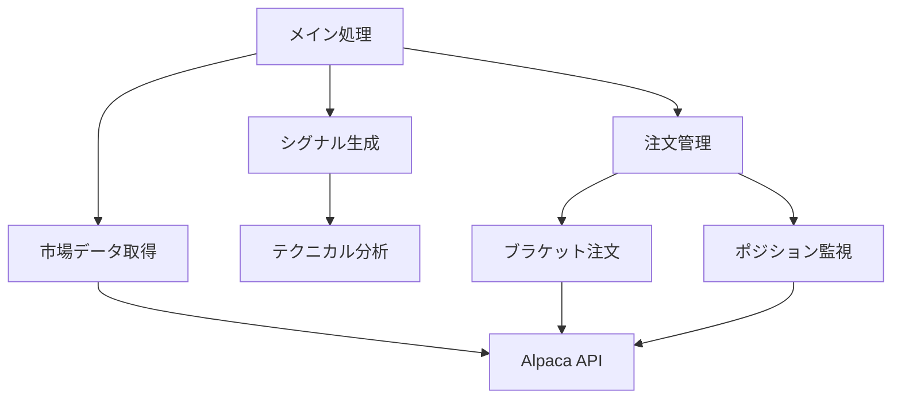
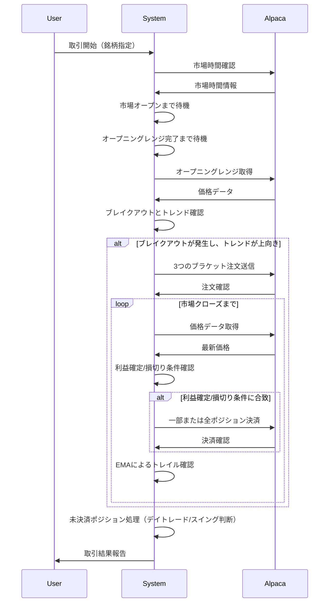

# ORB取引システム設計書

## 1. 概要

ORB（Opening Range Breakout）取引戦略を自動化するシステムです。この戦略は、取引日の最初の数分間（オープニングレンジ）で形成された価格範囲のブレイクアウトを検出し、その方向に取引を行います。

## 2. システム構成

## 3. 主要機能

### 3.1 市場データ取得

- Alpaca APIを利用して市場データを取得
- 1分足、5分足、日足のデータを取得可能
- テスト/ライブモードの切り替え機能あり

### 3.2 シグナル生成

- オープニングレンジのブレイクアウト検出
- 複数のEMA（指数移動平均）を用いたトレンド判定
- 株価のボラティリティに基づく動的なリスク/リワード設定

### 3.3 注文管理

- ブラケット注文（メイン注文、利益確定、損切り）の自動送信
- 3つの注文（短期、中期、長期）を同時に出して分散退出戦略を実装
- ポジションの監視と自動決済

## 4. 主要パラメータ

| パラメータ | 説明 | デフォルト値 |
|------------|------|-------------|
| STOP_RATE_1 | 第1注文の損切り率 | 6% |
| PROFIT_RATE_1 | 第1注文の利益確定率 | 6% |
| STOP_RATE_2 | 第2注文の損切り率 | 6% |
| PROFIT_RATE_2 | 第2注文の利益確定率 | 12% |
| STOP_RATE_3 | 第3注文の損切り率 | 6% |
| PROFIT_RATE_3 | 第3注文の利益確定率 | 30% |
| POSITION_SIZE | 1注文あたりのポジションサイズ | 設定可能 |
| ENTRY_PERIOD | 取引開始からのエントリー可能時間（分） | 120分 |

## 5. 取引フロー

## 6. 主要メソッド

| メソッド名 | 説明 |
|------------|------|
| start_trading() | 取引の開始ポイント。コマンドライン引数を解析し、取引パラメータを設定 |
| get_opening_range() | 指定された期間のオープニングレンジ（高値・安値）を取得 |
| is_opening_range_break() | 現在の価格がオープニングレンジを上回ったかどうかを判定 |
| is_above_ema() | 価格が指定されたEMAを上回っているかどうかを判定 |
| is_uptrend() | 短期EMAが長期EMAを上回り上昇傾向かどうかを判定 |
| submit_bracket_orders() | 3つのブラケット注文（利確・損切り付き）を送信 |
| cancel_and_close_position() | 指定された注文をキャンセルし、関連するポジションをクローズ |
| set_stop_profit_rate() | ボラティリティに基づいて各注文の損切り率と利益確定率を動的に設定 |

## 7. システム運用モード

### 7.1 ライブ取引モード
- 実際の市場に接続してリアルタイムで取引を実行
- Alpaca Live APIキーを使用
- 市場の開閉時間に合わせて自動的に動作

### 7.2 テストモード
- 過去のデータを使用して戦略をバックテスト
- 特定の日付と銘柄でテスト可能
- 結果をCSVファイルに出力して分析可能

## 8. その他の機能

- トレイルストップ：EMAを基準にしたトレイリングストップロス
- スイングトレード対応：市場終了後もポジションを保持する設定が可能
- デイリーボラティリティに基づく動的なリスク/リワード比率の設定
- ポジションサイズの自動計算
- トレード結果のレポート出力

## 9. 実装上の注意点

- リアルタイム取引の為、エラー処理が重視されている
- APIレート制限を考慮した設計
- 市場の開閉時間を厳密に管理
- スリッページを考慮した収益計算
- コマンドライン引数による柔軟なパラメータ設定

## 10. 拡張性と制限

### 10.1 拡張性
- 新しいエントリー条件の追加が可能
- 異なる時間枠での戦略の実装が可能
- 複数銘柄の同時取引に対応可能

### 10.2 制限
- Alpaca APIに依存
- 主に米国株式市場向けに設計
- 高頻度取引には最適化されていない
