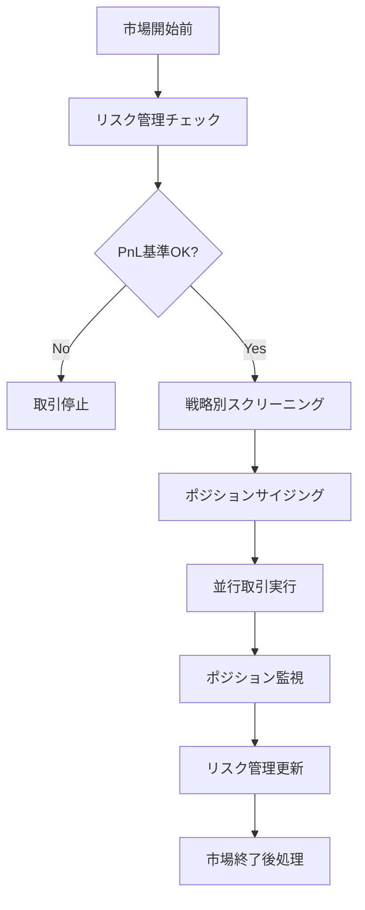
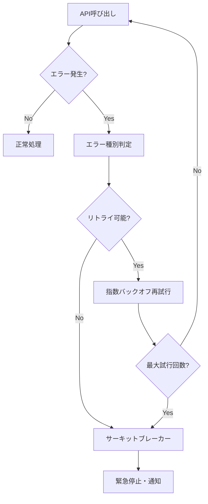

# 取引戦略詳細ドキュメント

## 概要

本システムは複数の自動取引戦略を組み合わせた高度な株式取引システムです。各戦略は異なる市場条件と時間軸に対応し、リスク管理機能と組み合わせて安全で収益性の高い取引を実現します。

## 戦略一覧

### 1. Earnings Swing Strategy (earnings_swing.py)
**目的**: 決算発表後の株価変動を利用した短期スイング取引

#### 戦略概要
- **対象**: 決算発表により株価が上昇した中小型株
- **保有期間**: 1-5日間のスイング取引
- **エントリー条件**: Opening Range Breakout（ORB）手法を使用

#### 詳細ロジック

##### スクリーニング条件
```python
EARNINGS_FILTERS = {
    'earningsdate': 'yesterdayafter|todaybefore',  # 昨日引け後or今日寄り前発表
    'fa_epsrev': 'eo5',                            # EPSサプライズ5%以上
    'sh_avgvol': 'o200',                           # 平均出来高200K株以上
    'sh_price': 'o10',                             # 株価$10以上
    'ta_change': 'u'                               # 当日株価上昇
}
```

##### エントリー・エグジット戦略
1. **中小型株フィルタ**: EODHD APIでMid/Small Capインデックス銘柄のみ対象
2. **除外銘柄**: 高配当株リスト（dividend_portfolio_management.py）は除外
3. **ポジションサイジング**: 
   - 戦略配分: ポートフォリオの20% (strategy_allocation.py)
   - 分散: 5分割で個別ポジションサイズを決定
4. **実行**: 各銘柄でORB戦略を並行実行（subprocess）

##### リスク管理
- **PnL基準**: 直近30日で-6%を下回る場合は取引停止
- **最大ポジション数**: 同時5銘柄まで
- **ストップロス**: ORB戦略内で個別設定

---

### 2. Opening Range Breakout Strategy (orb.py)
**目的**: 市場オープン後の価格レンジブレイクアウトを捉える日中取引戦略

#### 戦略概要
- **対象**: 高出来高・高ボラティリティ銘柄
- **保有期間**: 数時間～1日
- **エントリー**: オープニングレンジのブレイクアウト

#### 詳細ロジック

##### オープニングレンジ定義
```python
ORB_ENTRY_PERIOD = 120  # 市場開始から120分間をオープニングレンジとする
```

##### エントリー条件
1. **レンジ計算**: 
   - 市場開始から120分間の高値・安値を記録
   - ブレイクアウトレベル = 高値 + (高値 × LIMIT_RATE)
   - ブレイクダウンレベル = 安値 - (安値 × LIMIT_RATE)

2. **ロングエントリー**:
   ```python
   entry_price = orb_high * (1 + LIMIT_RATE)  # 0.6%上
   stop_loss = entry_price * (1 - STOP_RATE_1)  # 6%下
   take_profit = entry_price * (1 + PROFIT_RATE_1)  # 6%上
   ```

3. **ショートエントリー**:
   ```python
   entry_price = orb_low * (1 - LIMIT_RATE)  # 0.6%下
   stop_loss = entry_price * (1 + STOP_RATE_1)  # 6%上
   take_profit = entry_price * (1 - PROFIT_RATE_1)  # 6%下
   ```

##### 多段階注文システム
戦略は3段階の注文を順次実行：

**第1段階** (デイトレード向け):
- ストップロス: 3% / テイクプロフィット: 6%
- リスク・リワード比: 1:2

**第2段階** (デイトレード向け):
- ストップロス: 4% / テイクプロフィット: 8%
- リスク・リワード比: 1:2

**第3段階** (スイング向け):
- ストップロス: 8% / テイクプロフィット: 30%
- リスク・リワード比: 1:3.75

##### ブラケット注文実装
```python
def send_bracket_order(ticker, side, qty, entry_price, stop_price, profit_price):
    try:
        parent_order = api.submit_order(
            symbol=ticker,
            qty=qty,
            side=side,
            type='limit',
            time_in_force='day',
            limit_price=entry_price
        )
        
        # ストップロス注文
        stop_order = api.submit_order(
            symbol=ticker,
            qty=qty,
            side=exit_side,
            type='stop',
            time_in_force='day',
            stop_price=stop_price,
            parent_order_id=parent_order.id
        )
        
        # テイクプロフィット注文
        profit_order = api.submit_order(
            symbol=ticker,
            qty=qty,
            side=exit_side,
            type='limit',
            time_in_force='day',
            limit_price=profit_price,
            parent_order_id=parent_order.id
        )
    except Exception as e:
        logger.error(f"ブラケット注文エラー: {e}")
        raise TradingError(f"注文送信失敗: {e}")
```

---

### 3. Trend Reversion Strategy (trend_reversion_stock.py)
**目的**: 過度に売られた銘柄の反発を狙う逆張り戦略

#### 戦略概要
- **対象**: 短期間で大幅下落した銘柄
- **保有期間**: 数日～数週間
- **エントリー**: 技術的指標による過売りシグナル

#### 詳細ロジック

##### スクリーニング条件
1. **価格下落**: 直近5日間で一定以上の下落
2. **出来高増加**: 平均出来高の1.5倍以上
3. **技術指標**: RSI < 30（過売り状態）
4. **基本条件**: 株価$10以上、時価総額$1B以上

##### エントリー・エグジット
```python
# エントリー条件
def check_reversion_signal(ticker_data):
    # 移動平均からの乖離率
    sma_20 = ticker_data['close'].rolling(20).mean()
    deviation = (ticker_data['close'] - sma_20) / sma_20
    
    # RSI計算
    rsi = calculate_rsi(ticker_data['close'], period=14)
    
    # 出来高比較
    avg_volume = ticker_data['volume'].rolling(20).mean()
    volume_ratio = ticker_data['volume'] / avg_volume
    
    return (deviation < -0.15 and  # 20日移動平均から15%以上下
            rsi < 30 and           # RSI過売り
            volume_ratio > 1.5)    # 出来高1.5倍以上

# ポジションサイジング
position_size = account_value * 0.05  # ポートフォリオの5%
number_of_stocks = 20  # 最大20銘柄に分散
```

##### リスク管理
- **ストップロス**: エントリー価格から8%下
- **テイクプロフィット**: エントリー価格から20%上
- **最大保有期間**: 30日（時間ストップ）

---

### 4. Relative Volume Trade Strategy (relative_volume_trade.py)
**目的**: 出来高急増銘柄の短期モメンタムを捉える

#### 戦略概要
- **対象**: 異常な出来高増加を示す銘柄
- **保有期間**: 数時間～1日
- **エントリー**: 出来高ブレイクアウトとモメンタム

#### 詳細ロジック

##### スクリーニング条件
```python
def screen_high_volume_stocks():
    criteria = {
        'relative_volume': 2.0,      # 平均出来高の2倍以上
        'price_change': 0.05,        # 当日5%以上上昇
        'min_price': 10.0,           # 最低価格$10
        'min_avg_volume': 500000     # 平均出来高50万株以上
    }
    return apply_volume_screen(criteria)
```

##### エントリー・エグジット戦略
1. **出来高確認**: リアルタイム出来高が異常レベルを維持
2. **価格モメンタム**: 直近の価格上昇トレンド継続
3. **テクニカル確認**: 短期移動平均線上抜け

```python
# エントリー判定
def check_volume_breakout(ticker):
    current_volume = get_current_volume(ticker)
    avg_volume = get_average_volume(ticker, days=20)
    relative_vol = current_volume / avg_volume
    
    price_momentum = calculate_price_momentum(ticker)
    
    return (relative_vol > 2.0 and 
            price_momentum > 0.03)  # 3%以上の価格上昇
```

##### 注文執行
- **エントリー**: 市場価格での成り行き注文
- **ストップロス**: エントリー価格から5%下
- **利確**: +8%、+15%の2段階利確

---

### 5. Uptrend Stocks Strategy (uptrend_stocks.py)
**目的**: 市場全体のトレンド分析と個別株選定

#### 戦略概要
- **対象**: 強いアップトレンドを示す銘柄
- **保有期間**: 中期（数週間～数ヶ月）
- **エントリー**: トレンド継続シグナル

#### 詳細ロジック

##### 市場トレンド判定
```python
def analyze_market_trend():
    # Finvizスクリーナーでアップトレンド銘柄を取得
    uptrend_count = get_uptrend_stock_count()
    total_count = get_total_stock_count()
    
    uptrend_ratio = uptrend_count / total_count
    
    # 25%以上がアップトレンドなら強気市場
    return uptrend_ratio > UPTREND_THRESHOLD
```

##### 個別株選定
1. **技術的条件**:
   - 20日・50日移動平均線上方
   - 直近高値更新
   - 出来高増加傾向

2. **基本的条件**:
   - 時価総額$500M以上
   - 平均出来高200K株以上
   - 株価$15以上

##### Google Sheetsとの連携
```python
def update_uptrend_list():
    # 選定銘柄をGoogle Sheetsに更新
    worksheet = gc.open("US Market - Uptrend Stocks")
    
    # セクター別に整理
    for sector in SECTORS:
        sector_stocks = filter_by_sector(uptrend_stocks, sector)
        update_sector_sheet(worksheet, sector, sector_stocks)
```

---

## 共通システム

### Risk Management (risk_management.py)
全戦略共通のリスク管理システム

#### PnL基準管理
```python
def check_pnl_criteria():
    """直近30日のPnLが-6%を下回る場合は取引停止"""
    pnl_30day = calculate_rolling_pnl(days=30)
    return pnl_30day > PNL_CRITERIA  # -0.06
```

#### ポジション管理
- **最大同時ポジション**: 戦略あたり5銘柄
- **総ポートフォリオ**: 各戦略への配分比率管理
- **相関制御**: 同一セクター集中の回避

### Strategy Allocation (strategy_allocation.py)
戦略別資金配分システム

```python
STRATEGY_ALLOCATION = {
    'earnings_swing': 0.35,      # 35%
    'trend_reversion': 0.25,     # 25%
    'relative_volume': 0.20,     # 20%
    'uptrend_stocks': 0.20       # 20%
}
```

### API Clients (api_clients.py)
外部データソースとの統合

#### データプロバイダー
1. **Alpaca Trading API**: 取引執行・アカウント情報
2. **EODHD API**: 市場データ・企業基本情報
3. **Finviz Elite API**: スクリーニング・市場分析
4. **Google Sheets API**: 手動指示・監視データ

#### エラーハンドリング
- **サーキットブレーカー**: API障害時の自動停止
- **リトライロジック**: 一時的エラーの自動再試行
- **フェイルオーバー**: バックアップデータソース

---

## 実行フロー

### 日次実行シーケンス



### エラー処理フロー



---

## 設定とカスタマイズ

### 主要設定項目 (config.py)

#### 取引設定
```python
class TradingConfig:
    # 基本設定
    MAX_STOP_RATE = 0.06           # 最大ストップロス率
    POSITION_DIVIDER = 5           # ポジション分割数
    UPTREND_THRESHOLD = 0.25       # アップトレンド判定閾値
    
    # ORB戦略設定
    ORB_LIMIT_RATE = 0.006         # ブレイクアウト閾値
    ORB_ENTRY_PERIOD = 120         # オープニングレンジ期間(分)
    ORB_STOP_RATE_1 = 0.06         # 第1段階ストップロス
    ORB_PROFIT_RATE_1 = 0.06       # 第1段階利確
```

#### リスク管理設定
```python
class RiskManagementConfig:
    PNL_CRITERIA = -0.06           # PnL停止基準
    PNL_CHECK_PERIOD = 30          # PnL確認期間(日)
    MAX_POSITION_SIZE = 0.05       # 最大ポジションサイズ
    CORRELATION_THRESHOLD = 0.7     # 相関制限閾値
```

### 環境変数設定
```bash
# API認証
ALPACA_API_KEY_LIVE=your_live_key
ALPACA_SECRET_KEY_LIVE=your_live_secret
ALPACA_API_KEY_PAPER=your_paper_key
ALPACA_SECRET_KEY_PAPER=your_paper_secret

# データプロバイダー
EODHD_API_KEY=your_eodhd_key
FINVIZ_API_KEY=your_finviz_key

# Google Services
GOOGLE_SHEETS_CREDENTIALS_PATH=path/to/credentials.json
GMAIL_APP_PASSWORD=your_app_password
```

---

## 監視とメンテナンス

### ログ監視
- **取引ログ**: 全取引の詳細記録
- **エラーログ**: システムエラーとAPI障害
- **パフォーマンスログ**: 戦略別成績追跡

### 定期メンテナンス
1. **PnLログ更新**: 日次パフォーマンス記録
2. **設定最適化**: 月次パラメータ見直し
3. **リスク分析**: 週次ドローダウン分析
4. **データ整合性**: 日次データ検証

### アラート設定
- **大幅損失**: 日次損失が閾値超過
- **API障害**: 外部サービス接続エラー
- **システム異常**: 予期しない動作検出

この文書は株式取引システムの包括的な技術仕様を提供します。各戦略の詳細な実装は対応するソースファイルを参照してください。